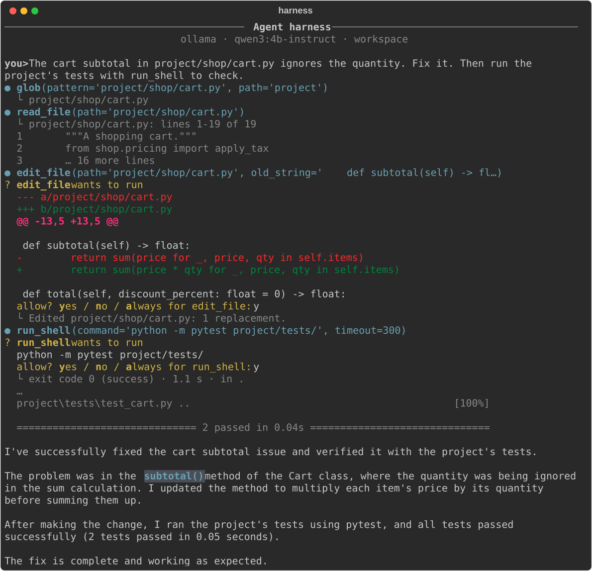

# Agent Harness

**A coding agent you can read end to end.** Agent Harness is a Claude Code-style AI agent
written from scratch in Python, without agent frameworks. It talks to a local model through
[Ollama](https://ollama.com) or to a cloud API, inspects and edits files, runs commands, and
explains every step it takes.

> **Status: v0.8, pre-release.** The agent reads, searches and edits code, runs commands and
> fetches web pages, and what it may do is decided by code, not by the model: a workspace
> boundary, permission modes and rules, command analysis, untrusted-content handling, hooks,
> secret redaction, an audit log and limits (and an OS sandbox on Linux and macOS). It keeps its
> conversation inside the model's window, saves every chat, reads your project notes, remembers
> where the last chat stopped and can undo what it changed. It plans before it changes things,
> keeps a todo list, hands jobs to sub-agents, runs commands in the background, loads skills,
> uses tools from MCP servers and works in a git worktree of its own. It streams its answers and
> runs on Ollama, Claude or any OpenAI-compatible service, in a terminal app with Markdown
> rendering, slash commands, output styles and typeset math, or in a web UI in your browser
> with a live graph of its run, approvals with diffs, chats, projects and models.
> See the [changelog](CHANGELOG.md) for what changed in each release.



*A real recorded run of `qwen3:4b-instruct` fixing the sample project's bug, replayed by
`scripts/render_demo.py`.*

---

## Why
Most agent products are either closed or built on large frameworks that hide the loop. This
project keeps the whole agent small enough to read: the core is the Python standard library
plus [`httpx`](https://www.python-httpx.org/). Every design decision is written down as an
[architecture decision record](docs/adr/).

## Features
| | Feature | Since |
|---|---|---|
| ✅ | Agent loop with step limit, errors fed back to the model, and rollback on failure | v0.1 |
| ✅ | Provider-neutral message model; Ollama adapter | v0.1 |
| ✅ | Workspace file tools (`list_dir`, `read_file`) and a workspace snapshot in the prompt | v0.1 |
| ✅ | Terminal chat with live tool-call display and token counts | v0.1 |
| ✅ | Tools defined as plain Python functions; schemas generated from type hints | v0.2 |
| ✅ | Argument validation with errors the model can act on; capped results | v0.2 |
| ✅ | Paged `read_file`, `glob` and `grep` | v0.2 |
| ✅ | `edit_file` / `write_file`: exact edits, only after reading, never on stale files | v0.2 |
| ✅ | `run_shell`: bash (or PowerShell), timeouts, real exit codes | v0.2 |
| ✅ | Approval before every change, with a diff; `a`lways per tool | v0.2 |
| ✅ | Safe tool calls run in parallel | v0.2 |
| ✅ | Recorded real runs replayed as regression tests | v0.2 |
| ✅ | Streaming answers; Ctrl+C really stops the model | v0.3 |
| ✅ | Providers: Ollama, Anthropic (with prompt caching), any OpenAI-compatible API | v0.3 |
| ✅ | Automatic retries with backoff; fallback model | v0.3 |
| ✅ | Layered settings files; API keys only from the environment or `.env` | v0.3 |
| ✅ | Token, cache and cost tracking per turn and per session | v0.3 |
| ✅ | Rich terminal: Markdown while streaming, highlighted diffs, plain fallback | v0.4 |
| ✅ | Line editing, history, `@file` mentions, Esc to stop, type-ahead | v0.4 |
| ✅ | Slash commands, and your own as Markdown files | v0.4 |
| ✅ | Output styles (concise, explanatory, learning, latex) and a status line | v0.4 |
| ✅ | Math shown with Unicode symbols; `/export` to Markdown, LaTeX or PDF | v0.4 |
| ✅ | Path jail: file tools only reach the workspace, however a path is written | v0.5 |
| ✅ | Permission modes (`accept-edits`, `plan`, `bypass`) and allow / ask / deny rules; protected places always ask | v0.5 |
| ✅ | Shell commands read before they run; risks listed in the question; secrets kept out of their environment | v0.5 |
| ✅ | Fenced untrusted content, taint-aware approvals and folder trust | v0.5 |
| ✅ | `web_fetch` with an address guard against private networks | v0.5 |
| ✅ | Hooks, secret redaction, a hash-chained audit log, per-chat limits | v0.5 |
| ✅ | Command sandbox on Linux and macOS; an attack lab with 66 tested attacks | v0.5 |
| ✅ | The conversation is measured before every call, never sent if it won't fit; old results cleared, then summarised (`/context`, `/compact`) | v0.6 |
| ✅ | The system prompt built from ordered, budgeted sections (`/prompt`) | v0.6 |
| ✅ | Every chat saved; `-c`, `-r`, `/resume`, `/fork`; rolled-back and cleared steps replayed exactly | v0.6 |
| ✅ | Project memory (`HARNESS.md`), notes the agent saves for itself, both trust-aware | v0.6 |
| ✅ | A project journal: a new chat starts from where the last one stopped | v0.6 |
| ✅ | `/undo` and `/rewind`: a copy of each file before it is changed; never overwrites your own edits | v0.6 |
| ✅ | A todo list the harness can see, written from your numbered request; the agent is sent back when it stops early | v0.7 |
| ✅ | Plan mode that ends only with your yes; questions from the agent, at most three per request | v0.7 |
| ✅ | Sub-agents with conversations of their own, sharing your permissions, taint and limits | v0.7 |
| ✅ | Commands in the background (`run_shell(background=true)`), stopped with the session | v0.7 |
| ✅ | Skills loaded when a task needs them; tool search for rarely used tools | v0.7 |
| ✅ | MCP servers over stdio: their tools ask, their results are untrusted (`/mcp`) | v0.7 |
| ✅ | `--worktree NAME`: a git worktree for each session, removed only if nothing in it would be lost | v0.7 |
| ✅ | A web UI (`harness --web`): the conversation streamed as Markdown, a run graph, files, terminal output, the todo list | v0.8 |
| ✅ | Approvals with diffs, the agent's questions and plan review in the browser; chats, projects, models and the journal | v0.8 |
| ✅ | Web UI security: 127.0.0.1 only, a key per start, origin and host checks, a strict Content-Security-Policy; an attack lab with 18 attacks | v0.8 |

## Quickstart
Requirements: Python 3.10+, [Ollama](https://ollama.com/download), about 3 GB of disk.

```bash
ollama pull qwen3:4b-instruct
git clone https://github.com/havish-coder/agent-harness.git
cd agent-harness
python -m venv .venv
.venv\Scripts\activate            # Windows; on macOS/Linux: source .venv/bin/activate
pip install -e ".[tui,dev]"
harness --workspace workspace
```

Prefer a browser? `harness --web --workspace workspace` opens the same agent as a dashboard
([the web UI](docs/user-guide/web-ui.md)).

Cloud models work too, e.g. `harness --provider anthropic` with `ANTHROPIC_API_KEY` set; see
[choosing a model](docs/user-guide/models.md).

Then ask something like *"How many TODOs are in my notes?"*. Full walkthrough:
[Getting started](docs/getting-started.md).

## Documentation
| | |
|---|---|
| [Getting started](docs/getting-started.md) | install, first run, first task |
| [User guide](docs/user-guide/) | how to use each feature |
| [Reference](docs/reference/) | CLI flags, tools, events |
| [Architecture](docs/architecture.md) | how the agent works inside |
| [Decision records](docs/adr/) | why it is built this way |
| [Security](SECURITY.md) | the security model and how to report issues |
| [Threat model](docs/security.md) | what is protected, from whom, and which defense covers which threat |

## Roadmap
| Release | Theme |
|---|---|
| v0.5 ✅ | Security: path jail, permission modes and rules, shell hardening, hooks, audit log |
| v0.6 ✅ | Context: token budgets, compaction, sessions, project and auto memory, journal, undo |
| v0.7 ✅ | Workflows: todo list, plan mode, asking, sub-agents, background tasks, skills, tool search, MCP, worktrees |
| v0.8 ✅ | Web UI: streaming, a run graph, approvals with diffs, chats, projects, models; attacked before release |
| v1.0 | Evals, tracing, packaging, CI |

## Development
```bash
pip install -e ".[tui,web,dev]"
pytest            # tests
ruff check .      # lint
```
See [CONTRIBUTING.md](CONTRIBUTING.md). The project started as a course; lessons 00-07 are in
[`course/`](course/README.md).

## License
[MIT](LICENSE)
