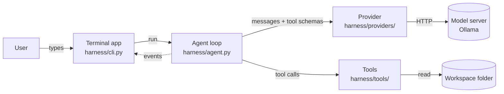
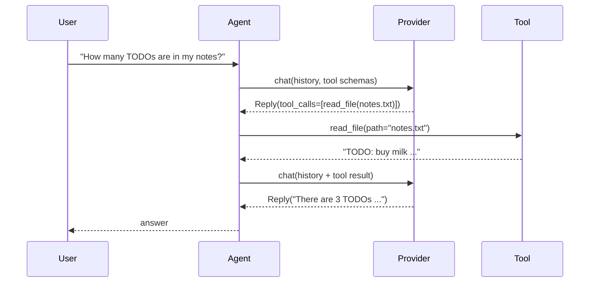

# Architecture

This page explains how Agent Harness works inside: the parts, how a request flows through
them, and the rules that keep them separate. It describes the current release; each release
updates it.

## The big picture



| Part | Responsibility | Knows about |
|---|---|---|
| **Terminal app** | reading input, printing answers and events | the agent, the event names |
| **Agent loop** | calling the model, running tools, keeping the history | the provider interface, tools |
| **Provider** | translating between our messages and one vendor's API | one model server |
| **Tools** | doing things in the workspace, returning text | the workspace |

The arrows only go one way. The agent loop never prints and never imports the terminal app;
providers never see tools' code; tools never see messages. This is what lets the same agent
run in a terminal today and in a web server later.

## A request, step by step



The loop repeats *call the model → run the requested tools → append the results* until the
model answers without asking for tools, or until the step limit (default 10) is reached.

## Key design rules

### 1. One message format inside, many outside
Every provider speaks its own JSON dialect. Inside the harness there is exactly one format,
defined in [`harness/messages.py`](../harness/messages.py): `Message`, `ToolCall`, `Reply` and
`Usage`. Each provider adapter translates in both directions. See
[ADR 0003](adr/0003-provider-neutral-message-model.md).

### 2. Tool errors are results, not crashes
If a tool fails, or the model calls a tool that doesn't exist or passes wrong arguments, the
error becomes the tool's result text. The model reads it on its next step and usually fixes
its own mistake.

### 3. A turn either completes or never happened
If anything goes wrong mid-turn (the server fails, the user presses Ctrl+C), the agent
deletes every message the turn added. The history therefore never ends with a tool request
that has no result, which some APIs reject.

### 4. The loop reports, it doesn't print
The agent emits events through an `on_event(kind, data)` callback. Interfaces decide what to
show. See the [events reference](reference/events.md).

## Source layout

```
harness/
  agent.py          the agent loop
  messages.py       provider-neutral message types
  cli.py            the terminal app (`harness` command)
  providers/
    base.py         the Provider interface and ProviderError
    ollama.py       Ollama adapter (/api/chat)
  tools/
    base.py         the Tool type and the @tool decorator
    fs.py           list_dir, read_file, workspace_snapshot
scripts/            setup check and teaching scripts
workspace/          a sample folder to try the agent on
docs/               this documentation
```
