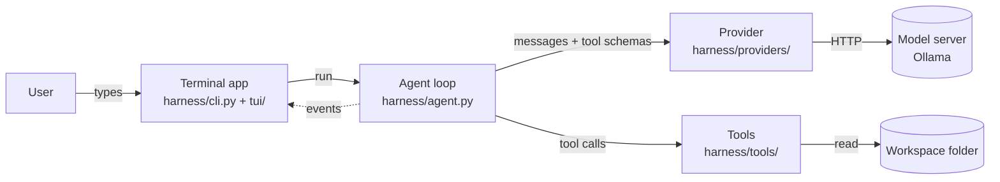
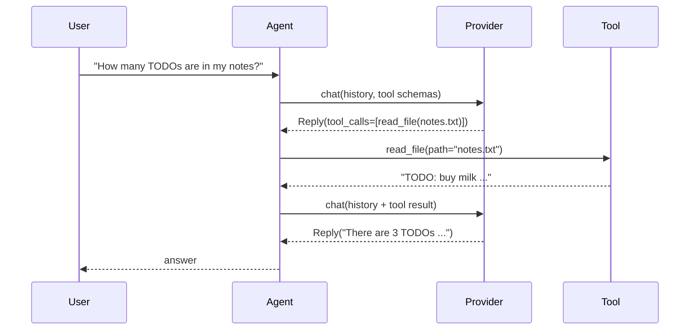
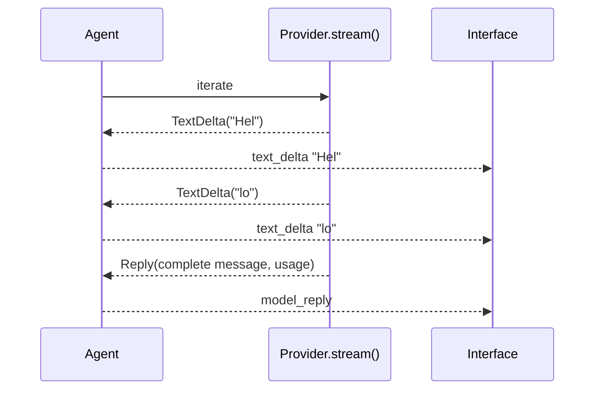
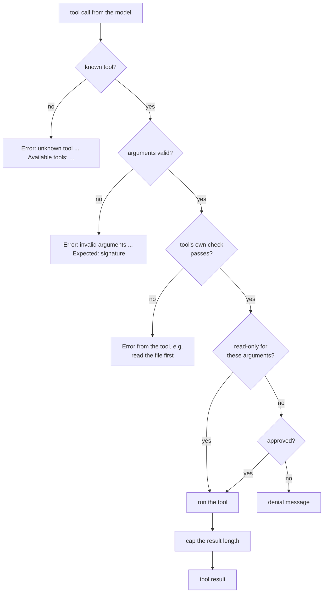
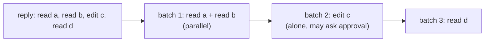

# Architecture

This page explains how Agent Harness works inside: the parts, how a request flows through
them, and the rules that keep them separate. It describes the current release; each release
updates it.

## The big picture



| Part | Responsibility | Knows about |
|---|---|---|
| **Terminal app** | reading input, printing answers and events | the agent, the event names |
| **Agent loop** | calling the model, running tools, keeping the history | the provider interface, tools |
| **Provider** | translating between our messages and one vendor's API | one model server |
| **Tools** | doing things in the workspace, returning text | the workspace |

The arrows only go one way. The agent loop never prints and never imports the terminal app;
providers never see tools' code; tools never see messages. This is what lets the same agent
run in a terminal today and in a web server later.

## A request, step by step



The loop repeats *call the model → run the requested tools → append the results* until the
model answers without asking for tools, or until the step limit (default 10) is reached.

## Streaming

A provider may implement `stream()` in addition to `chat()`: a generator that yields pieces of
text (`TextDelta`, `ThinkingDelta`) as the model produces them, and the complete `Reply` last.
The agent forwards each piece as an event, so interfaces can show the answer as it's written.
Closing the generator (on Ctrl+C or any error) closes the HTTP connection, which makes the
model server stop generating. See [ADR 0013](adr/0013-streaming-generators.md).



## Retries

Interfaces wrap the provider in `RetryingProvider`
([`harness/providers/retry.py`](../harness/providers/retry.py)). It retries errors marked
`retryable` (connection failures, timeouts, 408, 409, 429, 5xx, overloaded) with exponential
backoff and jitter, honours `Retry-After`, stops at a total waiting budget, and can hand the
call to a fallback provider. A stream is retried only if it failed before its first piece of
text. The agent loop never sees a retried failure. See
[ADR 0016](adr/0016-retry-policy.md).

## Running one tool call

Every call the model makes goes through the same checks, in this order. Each "no" becomes a
text result the model reads on its next step; nothing here can crash the loop.



The checks live in [`harness/tools/registry.py`](../harness/tools/registry.py) (lookup,
validation, running, truncation) and [`harness/agent.py`](../harness/agent.py) (the tool's
own `check`, then the approval decision, [ADR 0005](adr/0005-approve-every-non-read-only-call.md)).
A tool's check runs before approval so you are never asked to approve a call that would fail.

## Several calls in one reply

A model may ask for several tools at once (in our measurements, 4 of 7 tool-calling replies
did). The agent splits them into **batches**, in order: consecutive calls whose tools are
*concurrency-safe* share a batch and run on threads (up to 8 at a time); any other call is a
batch of its own. Results always go back in the order the model asked, and events are
emitted from the main thread.



Approval prompts therefore never overlap: only tools that aren't concurrency-safe can need
approval, and they always run alone. See
[ADR 0010](adr/0010-parallel-safe-tool-calls.md).

## Key design rules

### 1. One message format inside, many outside
Every provider speaks its own JSON dialect. Inside the harness there is exactly one format,
defined in [`harness/messages.py`](../harness/messages.py): `Message`, `ToolCall`, `Reply` and
`Usage`. Each provider adapter translates in both directions. See
[ADR 0003](adr/0003-provider-neutral-message-model.md).

### 2. Tool errors are results, not crashes
If a tool fails, or the model calls a tool that doesn't exist or passes wrong arguments, the
error becomes the tool's result text. The model reads it on its next step and usually fixes
its own mistake.

### 3. A turn either completes or never happened
If anything goes wrong mid-turn (the server fails, the user presses Ctrl+C), the agent
deletes every message the turn added. The history therefore never ends with a tool request
that has no result, which some APIs reject.

### 4. The loop reports, it doesn't print
The agent emits events through an `on_event(kind, data)` callback. Interfaces decide what to
show. See the [events reference](reference/events.md).

## Source layout

```
harness/
  agent.py          the agent loop
  messages.py       provider-neutral message types
  cli.py            the `harness` command: settings, the input loop, command dispatch
  session.py        one running session: provider with retries, agent, costs, UI
  commands.py       slash commands: built-in and Markdown-defined
  styles.py         output styles added to the system prompt
  export.py         /export: chats as Markdown, LaTeX (pandoc) or PDF (pandoc + Tectonic)
  tui/              terminal interfaces: rich (Markdown, diffs, spinner) and plain;
                    the line editor (prompt.py), the Esc/type-ahead key watcher (keys.py),
                    LaTeX math to Unicode (latex.py)
  mentions.py       @file mentions attached to messages
  providers/
    base.py         the Provider interface and ProviderError
    ollama.py       Ollama adapter (/api/chat, NDJSON streaming)
    openai_compat.py  OpenAI Chat Completions adapter (SSE streaming)
    anthropic.py    Anthropic Messages adapter (content blocks, named SSE events, prompt caching)
    factory.py      make_provider(name, model, ...) for interfaces
    retry.py        RetryingProvider: backoff, Retry-After, budget, fallback
    fake.py         scripted, recording and replaying providers for tests
  tools/
    base.py         the Tool type and the @tool decorator
    registry.py     lookup, argument validation, running, result caps
    fs.py           list_dir, read_file, workspace_snapshot
    search.py       glob, grep
    edit.py         edit_file, write_file
    shell.py        run_shell
  workspace.py      path resolution and read tracking for all file tools
  config.py         settings layers, validation, .env loading
  usage.py          prices and per-session cost tracking
scripts/            setup check and teaching scripts
workspace/          a sample folder to try the agent on
docs/               this documentation
```
